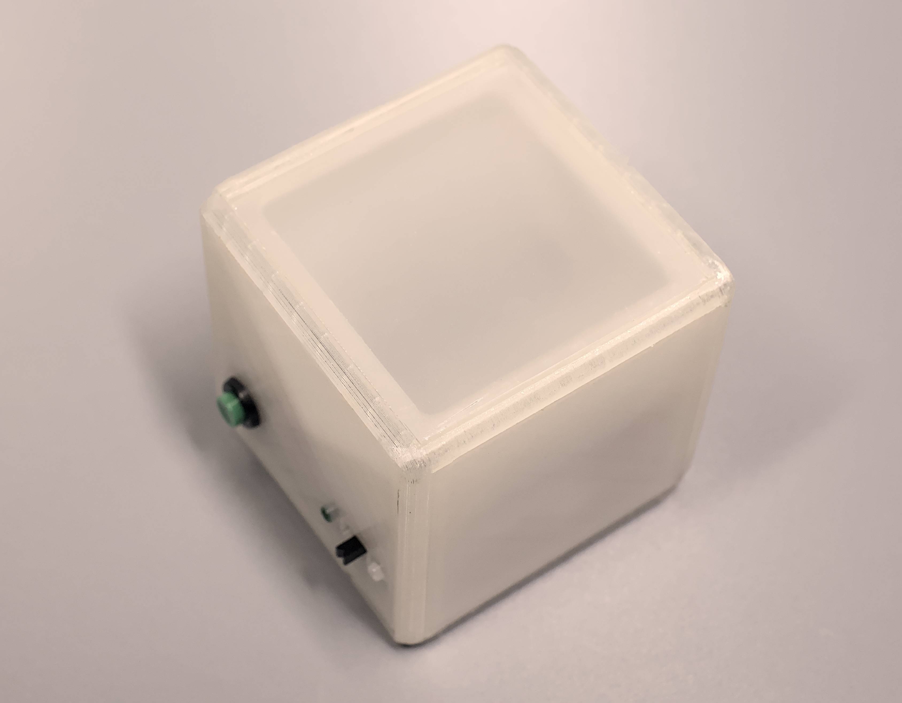
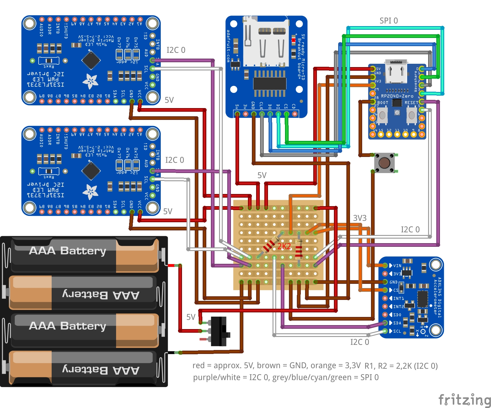

# ulisp-fairdice
Fair electronic dice
Programmed in [uLisp](http://www.ulisp.com)

# BOM:
- 2 x Adafruit LED Charlieplexed Matrix
- 2 x Adafruit 16x9 Charlieplexed PWM LED Matrix Driver
- Waveshare RP2040-Zero or comparably small RP2040 board
- breakout board with accelerometer ADXL345
- micro SD card reader module with SPI interface
- battery holder for 4x AAA side by side
- push button round for 11 mm hole
- miniature slide switch, bore hole distance approx. 15 mm, dimensions 11 x 6 mm 
- 2 resistors 2,2 K
